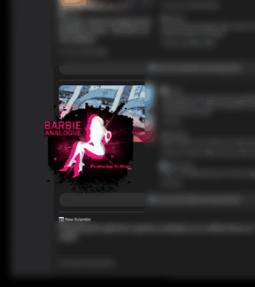
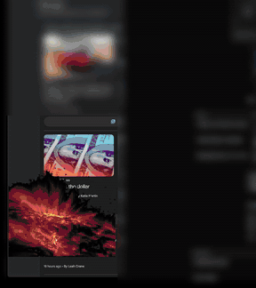
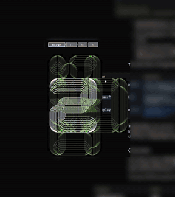

# ethos_viewer (Win32 desktop, funky C# interop)

**Your own art gallery, floating on your desktop.**

Every day you scroll past images worth keeping: a painting, a poster, a photo that stops you for a second. Bookmarks bury them and screenshot folders forget them. ethos_viewer gives them a wall.

Drag an image off any web page onto it, or just press Ctrl+V, and it joins your collection for good, stored in your own SQL Server database. Then it hangs on your desktop in a borderless, always-on-top frame that quietly rotates through everything you've saved, a new piece every minute or so.

- **No chrome, just the art.** No title bar, no border. The picture *is* the window.
- **Black is see-through.** Images on a black background float directly over whatever is behind them, like a sticker on your screen.
- **Put it anywhere.** Pin it to a corner, stretch it from any edge, wheel-zoom it bigger, flick through the collection with the arrow keys.
- **Collecting takes one gesture.** Drag, drop, done. Ctrl+C hands any piece back out again.
- **Yours, everywhere.** Point two machines at the same database and they share one gallery.

<p align="center">
  
  
  
</p>

## Adding to your gallery

- **Paste (Ctrl+V).** An image on the clipboard, for example from *Copy image* in a browser or a screenshot tool, is added straight away. If the clipboard holds an image URL instead, the image is downloaded and added.
- **Drag and drop.** Drop onto the viewer:
    - an image dragged out of a web page,
    - an image file from Explorer,
    - a link ending in `.jpg`, `.jpeg`, `.png` or `.gif`.
- **Text.** Drop any other text and it is saved as a quote. Quotes are shown full-size in the viewer, growing until they fill the window.
- **Copy out (Ctrl+C).** Copies the image you are looking at, ready to paste into anything else.

Animated GIFs keep their animation.

## How the window works

The viewer (`DisplayForm`) has no title bar or border, yet it drags and resizes like a normal window. It does this with a few lines of Win32 rather than custom chrome:

- **Drag.** `WndProc` answers `WM_NCHITTEST` with `HTCAPTION` for the window's own surface, so Windows treats it as a title bar. Clicks on the picture (a child window) call `ReleaseCapture()` and send `WM_NCLBUTTONDOWN` / `HTCAPTION` to the form. Either way, Windows' own move loop does the dragging.
- **Resize.** The same hit test returns `HTLEFT`, `HTTOPRIGHT` and so on inside a 5 px band that is also the form's `Padding`, which gives an invisible sizing border on all eight edges and corners.
- **See-through background.** `BackColor` and `TransparencyKey` are both black, so the window is a colour-keyed layered window. The hover frame is the padding band switching from black (keyed out) to grey.
- **Hover chrome.** Because the surface reports itself as caption, the form receives `WM_NCMOUSEMOVE` / `WM_NCMOUSELEAVE`, with `TrackMouseEvent(TME_NONCLIENT)` re-armed from the picture, to show and hide the frame and buttons.
- **Wheel zoom.** `WM_MOUSEWHEEL` resizes the whole window by ±20% with an eased 20-step animation.

## Controls

| Input | Action |
| --- | --- |
| Drag anywhere | Move the window |
| Drag an edge or corner | Resize |
| Mouse wheel | Zoom the window in or out |
| ← / → | Previous / next image |
| Double-click, Alt+Enter | Toggle full screen (Esc leaves full screen) |
| Ctrl+C | Copy the current image to the clipboard |
| Ctrl+V | Add the image (or image URL) on the clipboard to the gallery |
| Drop onto the viewer | Add an image, image file, image link or quote |
| S | Save the current image to `EthosPicSingles/` |
| W | Set the current image as the wallpaper |
| D, Delete | Delete the current image |
| Esc | Quit |

Running with `/s` starts it as a screensaver, full screen on a non-primary monitor. To install it as one, copy `ethos_viewer.exe` to `%WINDIR%\System32\ev.scr`.

## The database

The gallery is one SQL Server table, read and written through LINQ to SQL (`ethos.dbml`). Any SQL Server works: a local SQL Server Express or LocalDB instance, a server on your network, or Azure SQL Database.

```sql
CREATE TABLE dbo.ethos (
    id       INT IDENTITY PRIMARY KEY,
    quote    VARCHAR(4000)  NULL,      -- text, when the item is a quote
    pic      VARBINARY(MAX) NULL,      -- image bytes, when the item is a picture
    addedBy  VARCHAR(80)    NOT NULL,
    addedOn  DATETIME       NOT NULL,
    rank     FLOAT          NOT NULL,
    attrib   VARCHAR(80)    NULL,      -- attribution shown under a quote
    url      VARCHAR(4096)  NULL,      -- where the image came from
    nsfw     BIT            NULL,
    special  BIT            NULL,
    hash     NVARCHAR(50)   NULL       -- SHA-1 of the image bytes
);
```

On start-up the viewer loads the list without image bytes, then fetches each picture only when it is shown, so large collections start quickly.

## Building

- Visual Studio 2022, .NET Framework 4.8, Windows only.
- Open `ethos_viewer.sln` and build. The bundled `ImageListViewSource/` project builds with it.
- Create the table above in a SQL Server database.
- Copy `connectionStrings.example.config` to `connectionStrings.config` and point it at your database. The real file is git-ignored and copied next to the executable at build time.

## Third-party code

`ImageListViewSource/` is [ImageListView](https://github.com/oozcitak/imagelistview) by Özgür Özçıtak, licensed under the Apache License 2.0 (see `ImageListViewSource/ImageListView/License.txt`). Its project and resource files were modified to retarget the .NET Framework version.
